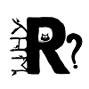

```{r setup, include = FALSE}
knitr::opts_chunk$set(echo = FALSE)
```

<br>

```{r, results = 'asis'}
cat(paste0("Witaj **", params$form$Dane[1], "** **",
           params$form$Dane[2], "**!"))
```

Dziękujemy Ci za zarejestrowanie się na ogólnopolską konferencję [Why R?](http://whyr.pl/) Twoje odpowiedzi z formularza są dostępne poniżej.

Jeżeli wyrażasz chęć dokonania jakichś zmian, proszę <a href="mailto:whyr@mini.pw.edu.pl">skontaktuj</a> się z nami.

```{r}
knitr::kable(params$form)
```

Płatności będziemy przyjmować najprawdopodobniej w czerwcu. Poinformujemy o tym w odpowiednim mailu.
Jeżeli potrzebujesz otrzymać fakturę za uczestnictwo w konferencji, odpisz proszę na tego maila, uwzględniając potrzebne dane.

Pamiętajcie o zgłaszaniu wystąpień. Zgłoszenia wystąpień dostępne są pod [tym linkiem](https://docs.google.com/forms/d/e/1FAIpQLSe3OAe5W09gMdSNDbGfuHd8aiOh84jQqSwXNAR6C5yQ72CFcg/viewform)

DODAĆ INFO O OPŁATACH

Organizatorzy


